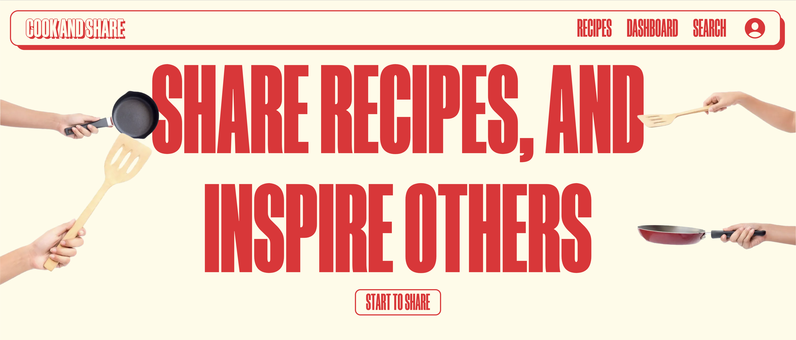

# Cook and Share

## Introduction

Cook and Share is a web application that allows users to share their favorite recipes with others. Users can create an account, add recipes, and view recipes from other users. The application also includes a backoffice system made using Strapi, where administrators can manage users, recipes, and categories.

## Technologies

- NextJs
- NextAuth
- Strapi
- TypeScript
- Tailwind CSS
- Jest and React Testing Library

## Features

- User authentication
- Add recipes
- View recipes
- Search recipes
- Filter recipes by category
- Admin system to manage users, recipes, and categories (Strapi)
- Responsive design

## License

This project is distributed under the [MIT License](LICENSE).

## Contact
If you have any questions or need further assistance, please feel free to contact me on LinkedIn or Instagram.

